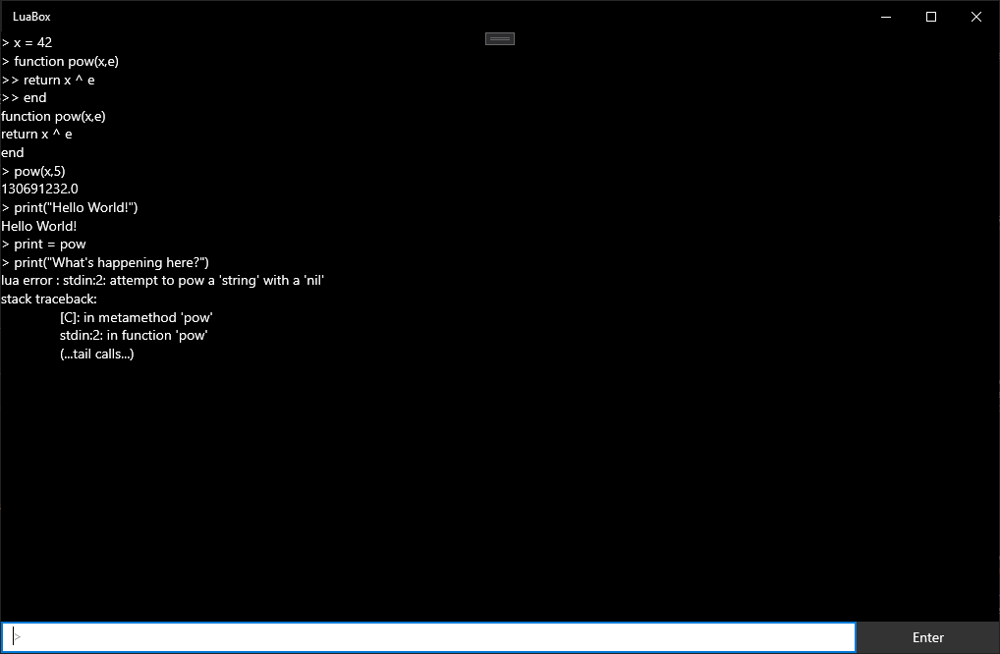

# LuaBox

A Lua VM + REPL in an UWP app!

If you ever wanted to, you can now run Lua 5.3 on your Xbox Series X/S.

This was a just-for-fun weekend project; I've never written any code for Microsoft platforms nor much C++ before, so the code is basically a mess. However hacking around in Lua's source code to make it work inside UWP was a decent bit of fun.

## To Do

* Extend the Lua library with some UWP functionality
	* Text-to-speech (for example, `uwp.say("Hi!")`)
* Up arrow to browse command history
* Graphics library/apps/...
  * Can LÖVE2D work?
* LuaJIT

## Motivation

A few days ago I treated myself to an Xbox Series S and as someone who can appreciate mini-ITX PCs (I mean, who can't?) I was immediately amazed at its tiny form factor. There's no power brick, it's completely inaudible, it's the fastest computer in my house by a margin of probably 200%, and it's just 300 bucks? Plus dev accounts are just $20 -- Microsoft actually *wants* you to code stuff for Xbox? 

Honestly, what a waste it'd be just running the occasional video game on this piece of hardware. (That's probably exactly what's gonna happen, but still I had to try.)

So the best way to make this thing useful as a general purpose computer is obviously going to be a full OS such as Linux. However considering that's seriously not in Microsoft's interests, no one managed to make it work on the last generation Xbox already (there's an *amazing* talk about the Xbox security model and exploits [here](https://www.youtube.com/watch?v=U7VwtOrwceo)). So I wouldn't get my hopes up.

You could of course run a VM but without OS and hardware support you're not going to get good performance, and the new consoles probably don't offer either. Next, porting an x86 emulator to UWP is likely no small feat considering x86 is a mess and a bunch of the C API is [missing](https://docs.microsoft.com/en-us/cpp/cppcx/crt-functions-not-supported-in-universal-windows-platform-apps?view=msvc-160). 

But a simpler VM might be easy to get to work. Lua is just 30KLoC, and it's literally designed to be embedded into apps or games. There's also LuaJIT which improves performance by anywhere between [1.5x and 120x](https://luajit.org/performance_x86.html); you might effectively see it as a hypervisor, if you squint a bit (or a lot?). So Lua isn't looking bad, except maybe there's no desktop OS built on top of it. But what's there to lose?

## Implementation

Basically, since Lua cleanly compiles as C++ and I couldn't for the life of me figure out how to compile and add it as a library in Visual Studio (and I must have tried about 400 times), I copied all of Lua's source into a blank C++ UWP app. At that point I could at least link against Lua and a lot of headaches were resolved. 

Next up was the actual porting work, which was surprisingly easy! As mentioned UWP doesn't support all of the C API but a lot of it. For Lua, the only relevant missing things are `_popen` and `_pclose`, which pertain to pipe functionality. So those won't work in this app. Also, UWP doesn't want you to just print to `stdout`, so we have to send our `lua_writestring` output somewhere else.

Finally, getting a nice REPL to work was actually the hardest (besides adding a library in VS). You would think it's easy, and a basic REPL is, but once you want it to handle multiline input, it actually needs to understand the code it's reading. Are we looking at an incomplete statement? Or have we encountered an unrecoverable syntax error? If it's the latter, we shouldn't wait for the next line.

Fortunately, I could orient myself on Lua's REPL which solves this quite nicely. I couldn't just copy it directly because UWP dictates control flow while Lua assumes the REPL does, but in the end I managed to create a close-enough REPLication. :)

